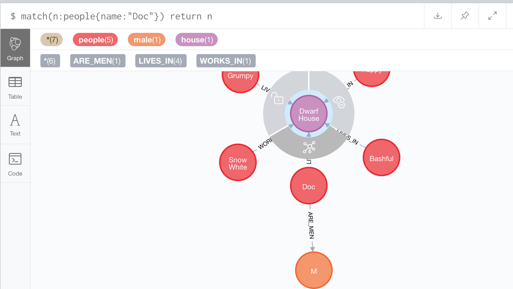

# Neo4j Testing

Trying to explore how to efficiently load and manipulate a GraphDb.

# Where is the Db ?

The DB is running on a Docker which I pulled from the Docker repo with

    docker pull neo4j

I start the docker image like this

```bash
docker run -p 7474:7474 -p 7473:7473 -p 7687:7687 -v "$(pwd)"/data:/data neo4j
```

Then open the base url:


    open http://localhost:7474

Login (password is Neo4j/Neo4j) -> now set the password to being something more secure.

### Dataclasses

After getting a little more comfortable with the Neo environment - I started wondering about how to make the loading of data easier. 

Now if you have SQLAlchemy in your stable of skills - this produces a class, just like a dataclass.

So can I manipulate the dataclass __repr__ to create my Cypher code ? Yes, it was quite simple.

This is much better for me - it means I can create a group (list) of objects and then use a generic module to insert them. As the dataclasses know their fields, names etc ... I can simplify the codebase.


### Checking the Graph

Run the code - it should load very fast... and enter this query


    match(n:people{name:"Doc"})
    return n

You should see something like this 


Now click Doc and press the Bottom network symbol.
The graph should be updated showing that "Doc" is connected to "M" and the "Dwarf House"


Now click on the "Dwarf House" - and repeat

Something like this should appear.




### Code Quality

I now have used Black, and pylint on this code. So it is ok from that point of view. 

I should however write some tests... maybe for another day.
